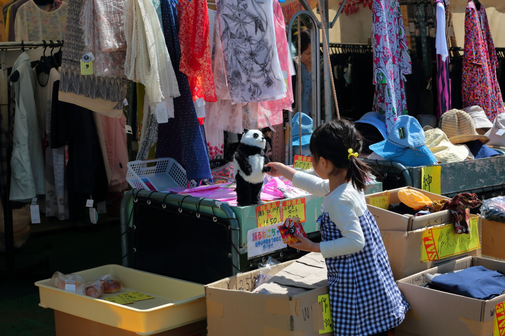

# shibasakura
<html lang="ja">
 <head>
  <meta charset="utf-8" />
 

<link href="https://cdnjs.cloudflare.com/ajax/libs/lightbox2/2.7.1/css/lightbox.css" rel="stylesheet">
   
</head>
<body>

<h1><marquee behavior="alternate">!!! 2019/04/28 栃木県芳賀郡市貝町、芝サクラ公園 !!!</marquee></h1>

  モバイル端末をお使いの場合は、画面を横向きにするとより見やすくご覧頂けます。

                              

  
Map 
<iframe src="https://www.google.com/maps/embed?pb=!1m18!1m12!1m3!1d14075.637550389267!2d140.11189349712555!3d36.6190145642217!2m3!1f0!2f0!3f0!3m2!1i1024!2i768!4f13.1!3m3!1m2!1s0x6021e743b7882e43%3A0x827218589b5d577d!2z5biC6LKd55S66Iqd44GW44GP44KJ5YWs5ZyS!5e0!3m2!1sja!2sjp!4v1556448594424!5m2!1sja!2sjp" width="600" height="450" frameborder="0" style="border:0" allowfullscreen></iframe>
                            

                             
          

  

 

<!-- フッタ -->
 <footer>
 Copyright 2019/04/28 torokoid
 </footer>
 </body>
